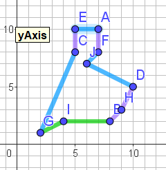
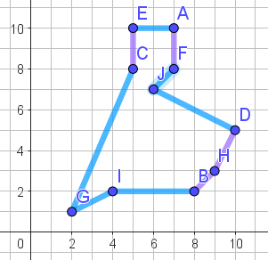
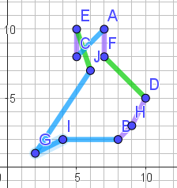
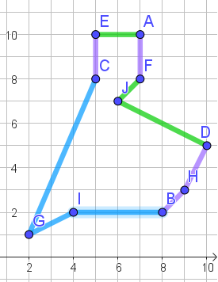
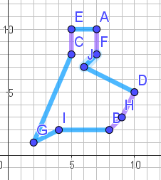
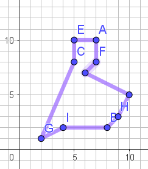
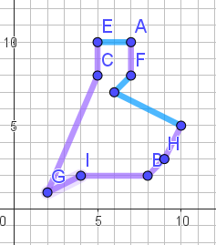

# Math476A2
Just used for latex in markdown

## 4a)
If the KGMA was run using the same route for both inputs, the out put would be the input route.  This is due to the algorithm retaing the set of edges common to both parents in the set, B.  In this case, the union of both parents would be all of their respective edges because they completely share all edges. Thus the child would be composed of the edges of the input $P_1$.  

## 4b)  

#### Generation 1
After 1 generation of the algorithm, all permutations except for R1R4 results in an identical route. In the images below, purple is the edges common to all routes, green edges are commmon to both parents and blue are the edges chose by the algorithm.

| R1R2 | R1R3 | R1R4 | R2R3 | R2R4 | R3R4 |
|:---:|:---:|:---:|:---:|:---:|:---:|  
|  |  |  |  |  |  | 

#### Generation 2
All in the generation of parents are identical except for R1R4. However, since all of the unique edges that R1R4 can contribute as a parent have a higher cost than the edges contributed by all the other identical parents, all the possible permutations result in one of the two pictures below. Purple edges are the edges in common to both parents and blue are edges selected by the algorithm from the unique contributed edges from the parents.

| R1R4 not a parent | R1R4 is a parent | 
|:---:|:---:|  
|  |  |  

### Rough Work Below

### Edge Lengths  

| &nbsp; | &nbsp; | &nbsp; | &nbsp; | &nbsp; | &nbsp; | &nbsp; | &nbsp; | &nbsp; |
|:---:|:---:|:---:|:---:|:---:|:---:|:---:|:---:|:---:|
| BH = $\sqrt{2}$ | CJ = $\sqrt{2}$ | FJ = $\sqrt{2}$ | AE = $\sqrt{4}$ | AF = $\sqrt{4}$ | CE = $\sqrt{4}$ | CF = $\sqrt{4}$ | DH = $\sqrt{5}$ | GI = $\sqrt{5}$ |
| AC = $\sqrt{8}$ | EF = $\sqrt{8}$ | AJ = $\sqrt{10}$ | EJ = $\sqrt{10}$ | BD = $\sqrt{13}$ | BI = $\sqrt{16}$ | DF = $\sqrt{18}$ | DJ = $\sqrt{20}$ | HJ = $\sqrt{25}$ |
| HI = $\sqrt{26}$ | BJ = $\sqrt{29}$ | FH = $\sqrt{29}$ | IJ = $\sqrt{29}$ | AD = $\sqrt{34}$ | CD = $\sqrt{34}$ | BF = $\sqrt{37}$ | BG = $\sqrt{37}$ | CI = $\sqrt{37}$ |
| CH = $\sqrt{41}$ | BC = $\sqrt{45}$ | DI = $\sqrt{45}$ | FI = $\sqrt{45}$ | DE = $\sqrt{50}$ | GJ = $\sqrt{52}$ | AH = $\sqrt{53}$ | GH = $\sqrt{53}$ | CG = $\sqrt{58}$ |
| AB = $\sqrt{65}$ | EH = $\sqrt{65}$ | EI = $\sqrt{65}$ | AI = $\sqrt{73}$ | BE = $\sqrt{73}$ | FG = $\sqrt{74}$ | DG = $\sqrt{80}$ | EG = $\sqrt{90}$ | AG = $\sqrt{106}$ |

####  Set B for all
| &nbsp; | &nbsp; | &nbsp; | &nbsp; | &nbsp; | &nbsp; | &nbsp; | &nbsp; | &nbsp; |
|:---:|:---:|:---:|:---:|:---:|:---:|:---:|:---:|:---:|
| BH = $\sqrt{2}$ | AF = $\sqrt{4}$ | CE = $\sqrt{4}$ | DH = $\sqrt{5}$ |

#### Set O for all
| &nbsp; | &nbsp; | &nbsp; | &nbsp; | &nbsp; | &nbsp; | &nbsp; | &nbsp; | &nbsp; |
|:---:|:---:|:---:|:---:|:---:|:---:|:---:|:---:|:---:|
| FJ = $\sqrt{2}$ | AE = $\sqrt{4}$ |  GI = $\sqrt{5}$ | AC = $\sqrt{8}$ | AJ = $\sqrt{10}$ | EJ = $\sqrt{10}$ | BI = $\sqrt{16}$ | DF = $\sqrt{18}$ | DJ = $\sqrt{20}$|  
| BJ = $\sqrt{29}$ | FH = $\sqrt{29}$ | IJ = $\sqrt{29}$ | AD = $\sqrt{34}$ | CD = $\sqrt{34}$ | BF = $\sqrt{37}$ | BG = $\sqrt{37}$ | CI = $\sqrt{37}$ | GJ = $\sqrt{52}$ |
| CG = $\sqrt{58}$ |

#### N All
| &nbsp; | &nbsp; | &nbsp; | &nbsp; | &nbsp; | &nbsp; | &nbsp; | &nbsp; | &nbsp; |
|:---:|:---:|:---:|:---:|:---:|:---:|:---:|:---:|:---:|
| CJ = $\sqrt{2}$ | CF = $\sqrt{4}$ | EF = $\sqrt{8}$ | BD = $\sqrt{13}$ | HJ = $\sqrt{25}$ |
| HI = $\sqrt{26}$ | BJ = $\sqrt{29}$ | FH = $\sqrt{29}$ | IJ = $\sqrt{29}$ | AD = $\sqrt{34}$ | CD = $\sqrt{34}$ | BF = $\sqrt{37}$ | BG = $\sqrt{37}$ | CI = $\sqrt{37}$ |
| CH = $\sqrt{41}$ | BC = $\sqrt{45}$ | DI = $\sqrt{45}$ | FI = $\sqrt{45}$ | DE = $\sqrt{50}$ | AH = $\sqrt{53}$ | GH = $\sqrt{53}$ | EH = $\sqrt{65}$ | EI = $\sqrt{65}$ | AI = $\sqrt{73}$ | BE = $\sqrt{73}$ | FG = $\sqrt{74}$ | DG = $\sqrt{80}$ | EG = $\sqrt{90}$ | AG = $\sqrt{106}$ |

####  Set B R1R2
| &nbsp; | &nbsp; | &nbsp; | &nbsp; | &nbsp; | &nbsp; | &nbsp; | &nbsp; | &nbsp; |
|:---:|:---:|:---:|:---:|:---:|:---:|:---:|:---:|:---:|
| BH = $\sqrt{2}$ | AF = $\sqrt{4}$ | CE = $\sqrt{4}$ | DH = $\sqrt{5}$ |GI = $\sqrt{5}$ | BI = $\sqrt{16}$ |

#### Set O R1R2
| &nbsp; | &nbsp; | &nbsp; | &nbsp; | &nbsp; | &nbsp; | &nbsp; | &nbsp; | &nbsp; |  
|:---:|:---:|:---:|:---:|:---:|:---:|:---:|:---:|:---:|  
| FJ = $\sqrt{2}$ | AE = $\sqrt{4}$ | AC = $\sqrt{8}$ | EJ = $\sqrt{10}$ | DF = $\sqrt{18}$ | DJ = $\sqrt{20}$ | GJ = $\sqrt{52}$ | CG = $\sqrt{58}$ |

#### Set N R1R2  
|:---:|:---:|:---:|:---:|:---:|:---:|:---:|:---:|:---:|  
| CJ = $\sqrt{2}$ | FJ = $\sqrt{2}$ | AE = $\sqrt{4}$ | CF = $\sqrt{4}$ | 
| AC = $\sqrt{8}$ | EF = $\sqrt{8}$ | AJ = $\sqrt{10}$ | EJ = $\sqrt{10}$ | BD = $\sqrt{13}$ |  DF = $\sqrt{18}$ | DJ = $\sqrt{20}$ | HJ = $\sqrt{25}$ |
| HI = $\sqrt{26}$ | BJ = $\sqrt{29}$ | FH = $\sqrt{29}$ | IJ = $\sqrt{29}$ | AD = $\sqrt{34}$ | CD = $\sqrt{34}$ | BF = $\sqrt{37}$ | BG = $\sqrt{37}$ | CI = $\sqrt{37}$ |
| CH = $\sqrt{41}$ | BC = $\sqrt{45}$ | DI = $\sqrt{45}$ | FI = $\sqrt{45}$ | DE = $\sqrt{50}$ | GJ = $\sqrt{52}$ | AH = $\sqrt{53}$ | GH = $\sqrt{53}$ | CG = $\sqrt{58}$ |
| AB = $\sqrt{65}$ | EH = $\sqrt{65}$ | EI = $\sqrt{65}$ | AI = $\sqrt{73}$ | BE = $\sqrt{73}$ | FG = $\sqrt{74}$ | DG = $\sqrt{80}$ | EG = $\sqrt{90}$ | AG = $\sqrt{106}$ |

####  Set BR1R3
| &nbsp; | &nbsp; | &nbsp; | &nbsp; | &nbsp; | &nbsp; | &nbsp; | &nbsp; | &nbsp; |
|:---:|:---:|:---:|:---:|:---:|:---:|:---:|:---:|:---:|
| BH = $\sqrt{2}$ | AF = $\sqrt{4}$ | CE = $\sqrt{4}$ | DH = $\sqrt{5}$ |

#### Set O for R1R3
| &nbsp; | &nbsp; | &nbsp; | &nbsp; | &nbsp; | &nbsp; | &nbsp; | &nbsp; | &nbsp; |
|:---:|:---:|:---:|:---:|:---:|:---:|:---:|:---:|:---:|
| FJ = $\sqrt{2}$ | AE = $\sqrt{4}$ | GI = $\sqrt{5}$ |
| AC = $\sqrt{8}$ | EJ = $\sqrt{10}$ | BI = $\sqrt{16}$ | DF = $\sqrt{18}$ | DJ = $\sqrt{20}$ | BG = $\sqrt{37}$ | CI = $\sqrt{37}$ | GJ = $\sqrt{52}$ |CG = $\sqrt{58}$ |

#### Set N for R1R3
| &nbsp; | &nbsp; | &nbsp; | &nbsp; | &nbsp; | &nbsp; | &nbsp; | &nbsp; | &nbsp; |
|:---:|:---:|:---:|:---:|:---:|:---:|:---:|:---:|:---:|
| CJ = $\sqrt{2}$ | FJ = $\sqrt{2}$ | AE = $\sqrt{4}$ | CF = $\sqrt{4}$ |  GI = $\sqrt{5}$ |
| AC = $\sqrt{8}$ | EF = $\sqrt{8}$ | AJ = $\sqrt{10}$ | EJ = $\sqrt{10}$ | BD = $\sqrt{13}$ | BI = $\sqrt{16}$ | DF = $\sqrt{18}$ | DJ = $\sqrt{20}$ | HJ = $\sqrt{25}$ |
| HI = $\sqrt{26}$ | BJ = $\sqrt{29}$ | FH = $\sqrt{29}$ | IJ = $\sqrt{29}$ | AD = $\sqrt{34}$ | CD = $\sqrt{34}$ | BF = $\sqrt{37}$ | BG = $\sqrt{37}$ | CI = $\sqrt{37}$ |
| CH = $\sqrt{41}$ | BC = $\sqrt{45}$ | DI = $\sqrt{45}$ | FI = $\sqrt{45}$ | DE = $\sqrt{50}$ | GJ = $\sqrt{52}$ | AH = $\sqrt{53}$ | GH = $\sqrt{53}$ | 
| AB = $\sqrt{65}$ | EH = $\sqrt{65}$ | EI = $\sqrt{65}$ | AI = $\sqrt{73}$ | BE = $\sqrt{73}$ | FG = $\sqrt{74}$ | DG = $\sqrt{80}$ | EG = $\sqrt{90}$ | AG = $\sqrt{106}$ |

####  Set B R1R4
| &nbsp; | &nbsp; | &nbsp; | &nbsp; | &nbsp; | &nbsp; | &nbsp; | &nbsp; | &nbsp; |
|:---:|:---:|:---:|:---:|:---:|:---:|:---:|:---:|:---:|
| BH = $\sqrt{2}$ | AF = $\sqrt{4}$ | CE = $\sqrt{4}$ | DH = $\sqrt{5}$ | EJ = $\sqrt{10}$ |DF = $\sqrt{18}$ | 

#### Set N For R1R4
| &nbsp; | &nbsp; | &nbsp; | &nbsp; | &nbsp; | &nbsp; | &nbsp; | &nbsp; | &nbsp; |
|:---:|:---:|:---:|:---:|:---:|:---:|:---:|:---:|:---:|
| GI = $\sqrt{5}$ | AC = $\sqrt{8}$ | AJ = $\sqrt{10}$ | BI = $\sqrt{16}$ | BG = $\sqrt{37}$ | CI = $\sqrt{37}$ | GJ = $\sqrt{52}$ |

#### Set O for R1R4
| &nbsp; | &nbsp; | &nbsp; | &nbsp; | &nbsp; | &nbsp; | &nbsp; | &nbsp; | &nbsp; |
|:---:|:---:|:---:|:---:|:---:|:---:|:---:|:---:|:---:|
| CJ = $\sqrt{2}$ | FJ = $\sqrt{2}$ | AE = $\sqrt{4}$ | CF = $\sqrt{4}$ |  GI = $\sqrt{5}$ |
| AC = $\sqrt{8}$ | EF = $\sqrt{8}$ | AJ = $\sqrt{10}$ | BD = $\sqrt{13}$ | BI = $\sqrt{16}$ | DF = $\sqrt{18}$ | DJ = $\sqrt{20}$ |
| HI = $\sqrt{26}$ | BJ = $\sqrt{29}$ | FH = $\sqrt{29}$ | IJ = $\sqrt{29}$ | AD = $\sqrt{34}$ | CD = $\sqrt{34}$ | BF = $\sqrt{37}$ | BG = $\sqrt{37}$ | CI = $\sqrt{37}$ |
| CH = $\sqrt{41}$ | BC = $\sqrt{45}$ | DI = $\sqrt{45}$ | FI = $\sqrt{45}$ | DE = $\sqrt{50}$ | GJ = $\sqrt{52}$ | AH = $\sqrt{53}$ | GH = $\sqrt{53}$ | CG = $\sqrt{58}$ |
| AB = $\sqrt{65}$ | EH = $\sqrt{65}$ | EI = $\sqrt{65}$ | AI = $\sqrt{73}$ | BE = $\sqrt{73}$ | FG = $\sqrt{74}$ | DG = $\sqrt{80}$ | EG = $\sqrt{90}$ | AG = $\sqrt{106}$ |

####  Set B R2R3
| &nbsp; | &nbsp; | &nbsp; | &nbsp; | &nbsp; | &nbsp; | &nbsp; | &nbsp; | &nbsp; |
|:---:|:---:|:---:|:---:|:---:|:---:|:---:|:---:|:---:|
| BH = $\sqrt{2}$ |FJ = $\sqrt{2}$ | AE = $\sqrt{4}$ | AF = $\sqrt{4}$ | CE = $\sqrt{4}$ | DH = $\sqrt{5}$ | DJ = $\sqrt{20}$ |

#### Set N for R2R3
| &nbsp; | &nbsp; | &nbsp; | &nbsp; | &nbsp; | &nbsp; | &nbsp; | &nbsp; | &nbsp; |
|:---:|:---:|:---:|:---:|:---:|:---:|:---:|:---:|:---:|
| GI = $\sqrt{5}$ | BI = $\sqrt{16}$ | BG = $\sqrt{37}$ | CI = $\sqrt{37}$ |GJ = $\sqrt{52}$ |CG = $\sqrt{58}$ |

#### Set O for R2R3
| &nbsp; | &nbsp; | &nbsp; | &nbsp; | &nbsp; | &nbsp; | &nbsp; | &nbsp; | &nbsp; |
|:---:|:---:|:---:|:---:|:---:|:---:|:---:|:---:|:---:|
| CJ = $\sqrt{2}$ | CF = $\sqrt{4}$ |  
| AC = $\sqrt{8}$ | EF = $\sqrt{8}$ | AJ = $\sqrt{10}$ | EJ = $\sqrt{10}$ | BD = $\sqrt{13}$ |  DF = $\sqrt{18}$ | HJ = $\sqrt{25}$ |
| HI = $\sqrt{26}$ | BJ = $\sqrt{29}$ | FH = $\sqrt{29}$ | IJ = $\sqrt{29}$ | AD = $\sqrt{34}$ | CD = $\sqrt{34}$ | BF = $\sqrt{37}$ | | |
| CH = $\sqrt{41}$ | BC = $\sqrt{45}$ | DI = $\sqrt{45}$ | FI = $\sqrt{45}$ | DE = $\sqrt{50}$ | AH = $\sqrt{53}$ | GH = $\sqrt{53}$ | 
| AB = $\sqrt{65}$ | EH = $\sqrt{65}$ | EI = $\sqrt{65}$ | AI = $\sqrt{73}$ | BE = $\sqrt{73}$ | FG = $\sqrt{74}$ | DG = $\sqrt{80}$ | EG = $\sqrt{90}$ | AG = $\sqrt{106}$ |

####  Set B R2R4
| &nbsp; | &nbsp; | &nbsp; | &nbsp; | &nbsp; | &nbsp; | &nbsp; | &nbsp; | &nbsp; |
|:---:|:---:|:---:|:---:|:---:|:---:|:---:|:---:|:---:|
| BH = $\sqrt{2}$ | AF = $\sqrt{4}$ | CE = $\sqrt{4}$ | DH = $\sqrt{5}$ |

#### Set N for R2R4
| FJ = $\sqrt{2}$ | AE = $\sqrt{4}$ | GI = $\sqrt{5}$ | AJ = $\sqrt{10}$  | BI = $\sqrt{16}$ | BG = $\sqrt{37}$ | CI = $\sqrt{37}$| GJ = $\sqrt{52}$ |

#### Set O for R2R4
| &nbsp; | &nbsp; | &nbsp; | &nbsp; | &nbsp; | &nbsp; | &nbsp; | &nbsp; | &nbsp; |
|:---:|:---:|:---:|:---:|:---:|:---:|:---:|:---:|:---:|
| CJ = $\sqrt{2}$  | CF = $\sqrt{4}$
| AC = $\sqrt{8}$ | EF = $\sqrt{8}$  | EJ = $\sqrt{10}$ | BD = $\sqrt{13}$ | DF = $\sqrt{18}$ | DJ = $\sqrt{20}$ | HJ = $\sqrt{25}$ |
| HI = $\sqrt{26}$ | BJ = $\sqrt{29}$ | FH = $\sqrt{29}$ | IJ = $\sqrt{29}$ | AD = $\sqrt{34}$ | CD = $\sqrt{34}$ | BF = $\sqrt{37}$ |
| CH = $\sqrt{41}$ | BC = $\sqrt{45}$ | DI = $\sqrt{45}$ | FI = $\sqrt{45}$ | DE = $\sqrt{50}$ | AH = $\sqrt{53}$ | GH = $\sqrt{53}$ | CG = $\sqrt{58}$ | AB = $\sqrt{65}$ | EH = $\sqrt{65}$ | EI = $\sqrt{65}$ | AI = $\sqrt{73}$ | BE = $\sqrt{73}$ | FG = $\sqrt{74}$ | DG = $\sqrt{80}$ | EG = $\sqrt{90}$ | AG = $\sqrt{106}$ |

#### Set B R3R4
| &nbsp; | &nbsp; | &nbsp; | &nbsp; | &nbsp; | &nbsp; | &nbsp; | &nbsp; | &nbsp; |
|:---:|:---:|:---:|:---:|:---:|:---:|:---:|:---:|:---:|
| BH = $\sqrt{2}$ | AF = $\sqrt{4}$ | CE = $\sqrt{4}$ | DH = $\sqrt{5}$ |  GI = $\sqrt{5}$ | BI = $\sqrt{16}$
 | BG = $\sqrt{37}$ | CI = $\sqrt{37} |
 
#### Set O for R3R4
| FJ = $\sqrt{2}$ | AE = $\sqrt{4}$| AJ = $\sqrt{10}$ | EJ = $\sqrt{10}$ | DJ = $\sqrt{20}$ |

#### Set N for R3R4
| &nbsp; | &nbsp; | &nbsp; | &nbsp; | &nbsp; | &nbsp; | &nbsp; | &nbsp; | &nbsp; |
|:---:|:---:|:---:|:---:|:---:|:---:|:---:|:---:|:---:|
| CJ = $\sqrt{2}$  | CF = $\sqrt{4}$  |
| AC = $\sqrt{8}$ | EF = $\sqrt{8}$  | BD = $\sqrt{13}$ | DF = $\sqrt{18}$ | HJ = $\sqrt{25}$
| HI = $\sqrt{26}$ | BJ = $\sqrt{29}$ | FH = $\sqrt{29}$ | IJ = $\sqrt{29}$ | AD = $\sqrt{34}$ | CD = $\sqrt{34}$ | BF = $\sqrt{37}$  |
| CH = $\sqrt{41}$ | BC = $\sqrt{45}$ | DI = $\sqrt{45}$ | FI = $\sqrt{45}$ | DE = $\sqrt{50}$ | GJ = $\sqrt{52}$ | AH = $\sqrt{53}$ | GH = $\sqrt{53}$ | CG = $\sqrt{58}$ |
| AB = $\sqrt{65}$ | EH = $\sqrt{65}$ | EI = $\sqrt{65}$ | AI = $\sqrt{73}$ | BE = $\sqrt{73}$ | FG = $\sqrt{74}$ | DG = $\sqrt{80}$ | EG = $\sqrt{90}$ | AG = $\sqrt{106}$ |
